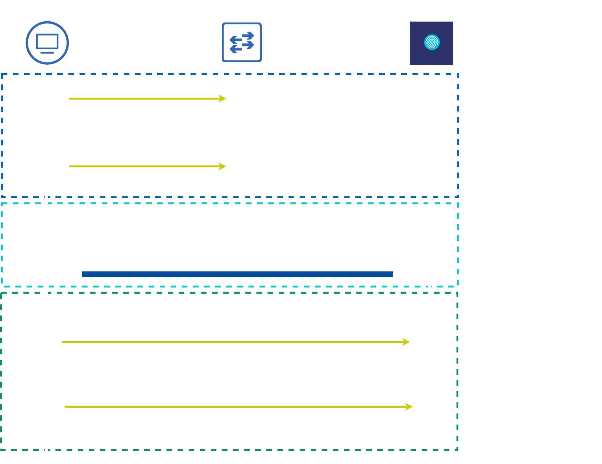
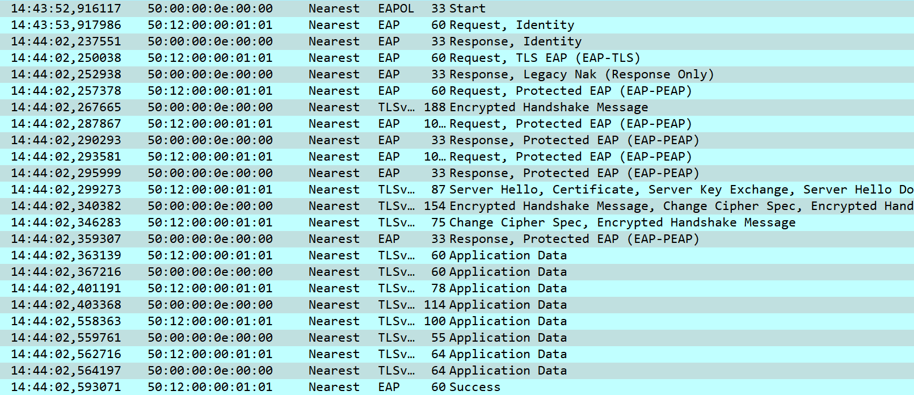
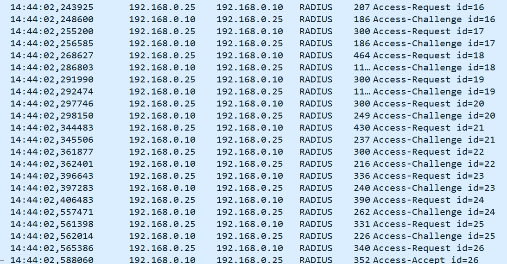
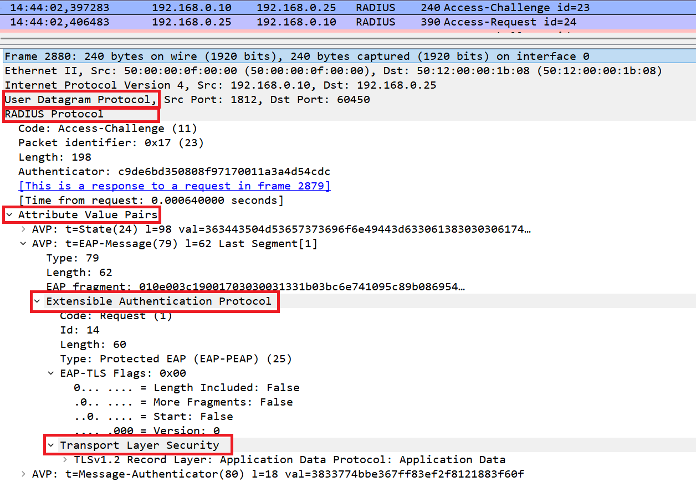
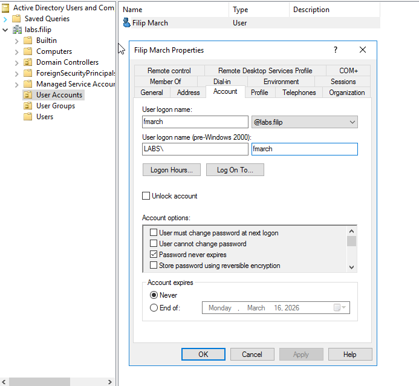
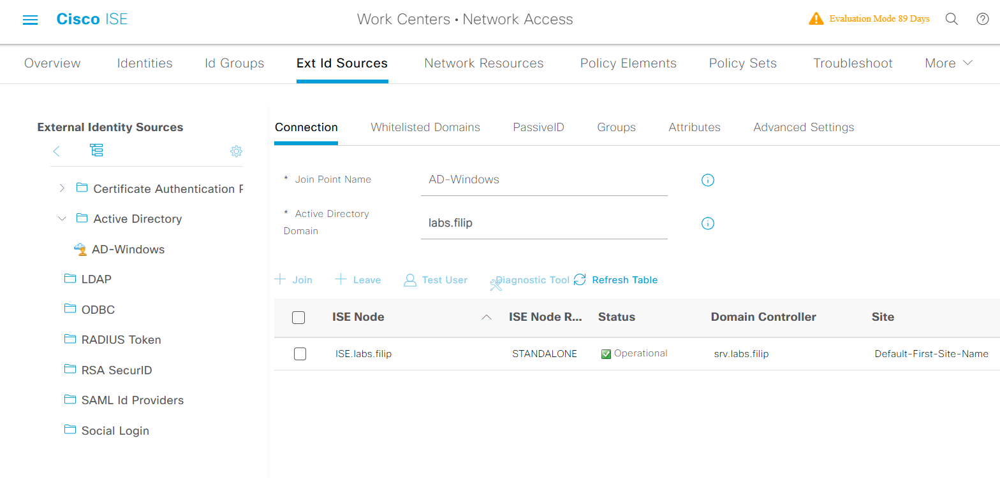
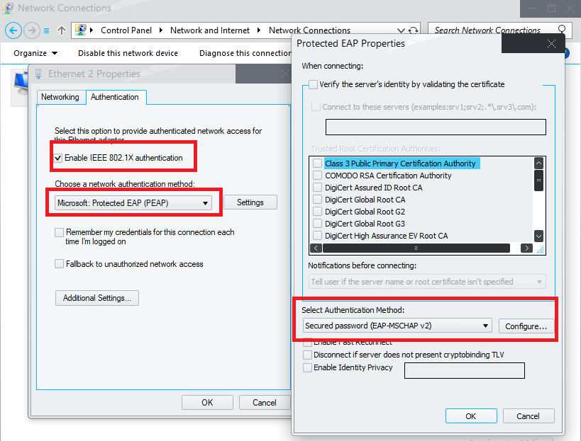
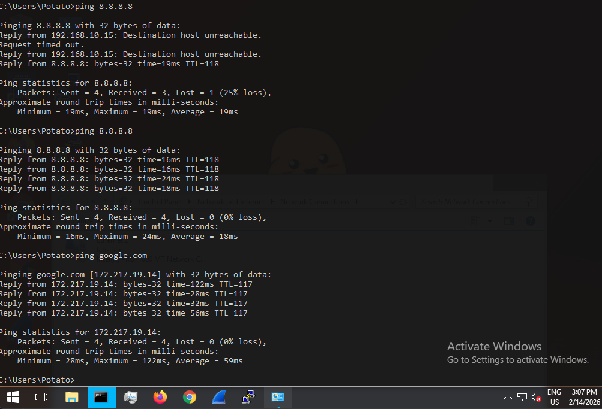
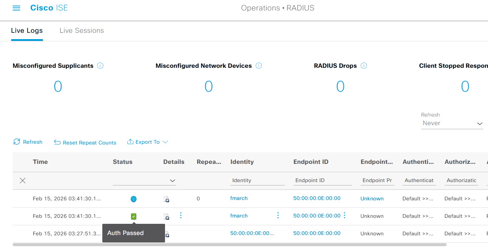
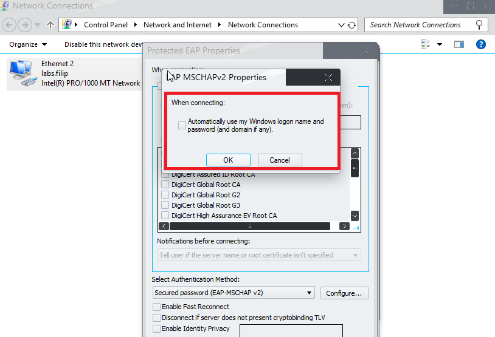

## The Problem of "Who's on Your Network?"

Imagine this scenario: A user walks into your office, plugs their laptop into an Ethernet port, and instantly gets full network access. **But is that laptop company-owned? Is it infected with malware? Is it even an employee?**

Traditional network security stops at the door—once you're plugged in, you're trusted. This is exactly where **802.1X** comes in. 

---

**802.1X is a standard for port-based authentication that prevents devices from accessing the network until they prove their identity.**

Below you can see simplified scheme of 802.1X in action, later on, we will explore the whole process behind it.


*Figure 1: Attacker trying to get access to network with and without 802.1X*


The 802.1X framework separates responsibilities across three distinct entities:

| Role                      | Device         | Responsibility                                                       |
| ------------------------- | -------------- | -------------------------------------------------------------------- |
| **Supplicant**            | Client device  | Proves identity (user credentials, machine certificate, MAC address) |
| **Authenticator**         | Network switch | Enforces access control, proxies authentication traffic              |
| **Authentication Server** | Cisco ISE      | Validates credentials, makes authorization decisions                 |


*Figure 2: Entities of 802.1X framework*

> The **supplicant** and **authentication server** never communicate directly. All authentication messages are encapsulated and forwarded by the switch. This behavior will be visible.
{: .prompt-info }

## The Role of EAP in 802.1X Authentication

While **802.1X** defines the framework for port-based access control, it does **not** define how credentials are actually validated. That’s where the **Extensible Authentication Protocol (EAP)** comes in. EAP provides a flexible framework for exchanging authentication messages while allowing multiple authentication mechanisms underneath.

In other words:

* **802.1X** controls *when* a port is authorized.
* **EAP** carries authentication messages between the supplicant and the authentication server.
* **EAP method** defines how a client’s identity is verified securely, for example using certificates (EAP-TLS) or a protected tunnel for passwords (PEAP).
* **Inner protocol (optional)**, such as MS‑CHAPv2, runs inside a tunnel-based EAP method to validate credentials like passwords.

EAP itself does not verify passwords or certificates; it only provides a standard format for messages and negotiation. The chosen EAP method performs the actual verification.

---

## Common EAP Methods

### 1. Certificate-based methods

**EAP-TLS**

* Uses client and server certificates for mutual authentication
* Authentication occurs during the TLS handshake itself
* No inner protocol required
* Strongest option when you can manage a PKI

```
EAP
 └── EAP-TLS
      └── TLS Handshake
```

---

### 2. Tunnel-based methods

**PEAP** and **EAP-TTLS** create a TLS tunnel first, then run a secondary authentication protocol inside that tunnel:

* Outer layer: TLS tunnel (server authentication + encryption)
* Inner layer: protocol like **MS‑CHAPv2** for password verification

```
EAP
 └── PEAP
      └── TLS Tunnel
           └── MS-CHAPv2
```

> MS‑CHAPv2 is **not** an EAP method — it must run inside a protected outer EAP method. The outer layer secures the exchange; the inner layer validates credentials against a directory (often Active Directory)
{: .prompt-warning }
---

### 3. Other / specialized methods

* **EAP-PSK** – pre-shared key authentication
* **EAP-SIM / AKA** – cellular SIM-based authentication
* **EAP-FAST** – Cisco tunnel method using PAC credentials
* **LEAP** – legacy, insecure, deprecated

The chosen method determines both security and operational complexity.

---

## Choosing an EAP Method: Why PEAP

In our setup, **we will be using the PEAP (Protected EAP) method**. PEAP is widely used in enterprise networks because it:

* Provides a **TLS-protected tunnel** between the client and authentication server
* Supports inner authentication protocols like **MS‑CHAPv2** for password verification
* Integrates smoothly with **Active Directory**
* Ensures that credentials are **never sent in cleartext** over the network

Unlike EAP-TLS, which requires managing client certificates, PEAP allows us to leverage existing username/password credentials securely inside the TLS tunnel.

---

## PEAP Authentication Flow Overview


*Figure 3: EAP/RADIUS Authentication process*
### I captured the whole process with Wireshark:


*Figure 4: Packet capture on link between Client and Switch*


*Figure 5: Packet Capture on link between ISE and Switch*

When a client connects to a switch port configured for 802.1X using PEAP, the following sequence occurs:

1. **Port Access Request** – The switch detects a new device and initiates 802.1X.

2. **EAPOL Start** – The client (supplicant) sends an EAPOL Start frame to the switch.

3. **Identity Request/Response** – The switch requests the user’s identity and forwards the response to the authentication server.

4. **TLS Tunnel Establishment** – PEAP sets up a TLS tunnel from the supplicant to the authentication server:

   * Server presents a certificate
   * Client validates the certificate
   * TLS encryption protects subsequent exchanges

5. **Inner Authentication** – Once the TLS tunnel is established, the client uses **MS‑CHAPv2** inside the tunnel to authenticate with Active Directory.

6. **Success/Failure** – The authentication server sends the result back through the switch. If successful, the switch opens the port for normal network access.

---

## How PEAP is Transported

### 1. LAN Side (Supplicant ↔ Switch)

```
Ethernet
 └── EAPOL
      └── EAP-PEAP
            └── TLS Handshake
                └── MS-CHAPv2 (inside TLS)
```

* Operates at Layer 2 (EAPOL)
* No IP addresses required
* Switch only proxies messages; it does **not** terminate TLS


*Figure 6: Wireshark EAPOL Capture*

### 2. Backend Side (Switch ↔ Authentication Server)

```
IP
 └── UDP (1812)
      └── RADIUS
           └── EAP-Message Attribute
                └── EAP-PEAP
                        └── TLS Tunnel
                               └── MS-CHAPv2
```

* The switch encapsulates the EAP payload inside RADIUS packets
* The authentication server terminates the TLS tunnel and validates MS‑CHAPv2 credentials
* Inner protocol traffic (MS‑CHAPv2) is **encrypted** inside the TLS tunnel, ensuring secure password verification



*Figure 7: Wireshark RADIUS Capture*

---

## Why This Flow Matters

* Credentials are **never transmitted in cleartext**
* TLS tunnel ensures **server authentication**, preventing man-in-the-middle attacks
* MS‑CHAPv2 allows us to integrate seamlessly with existing **Active Directory passwords**
* The switch always acts as a **transparent proxy**, making the flow consistent for all EAP methods

---

## Let's authenticate a Windows 10 PC!

Now let's put theory into practice. I've created a test user in Active Directory—we'll use these credentials to attempt network access.


*Figure 8: User Account in AD*

Cisco ISE is already configured to use AD as an external identity source, so it can validate credentials against our domain.

*Figure 9: ISE External Identity Source*

Initially, the user has no network access—the switch port is blocking all traffic until authentication succeeds.

*Figure 10: User with no access to network*

We enable 802.1X authentication on the network interface card (NIC) through Windows settings.

*Figure 11: Enabling 802.1X on NIC*

Windows immediately detects the secured port and prompts for credentials.

*Figure 12: Windows to enter AD credentials*

After entering valid domain credentials, the authentication process completes and the switch opens the port. The user now has full network access.

*Figure 13: User has access to network*

We can confirm the successful authentication in Cisco ISE's live logs. The user's session shows as Auth Passed, confirming that AD validated the credentials and ISE authorized the connection.

*Figure 14: ISE confirm user authentication*

It's worth mentioning that you can **automate** the credential input so users don't have to type anything. When a user is already logged into their Windows PC, the supplicant can automatically use their Windows logon name and password for 802.1X authentication.

Simply check the box shown below, and Windows will handle the rest—no additional prompts, no extra typing, seamless network access.


*Figure 15: Windows 802.1X automatic logon*

## What's Next?

The next article will focus on implementing what you just saw—a complete hands-on guide to building this 802.1X lab from scratch.